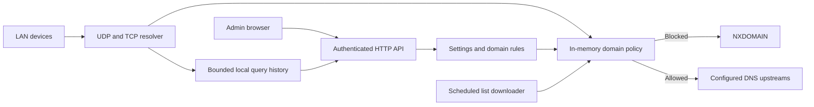

# Architecture

One Go process serves DNS and the embedded dashboard. The shipped frontend makes same-origin JSON requests; it does not contact external UI services.

## Source map

- `main.go`: lifecycle, listeners, shutdown, health check and local password recovery.
- `dns.go`: query validation, LAN admission, bounded concurrent forwarding, TCP fallback, CNAME policy checks and query events.
- `store.go`: configuration validation, synchronized policy maps, atomic JSON writes and bounded history.
- `lists.go`: curated source catalog, domain/hosts parsing, size-limited HTTPS downloads and last-working-copy caching.
- `api.go`: administrator setup, password hashing, sessions, HTTP protections and mutation endpoints.
- `web/`: embedded responsive dashboard and onboarding UI.
- `core_test.go`: backend tests using temporary stores and local fake DNS upstreams.
- `tests/`: frontend logic tests and browser interaction tests with a labelled API fixture.

## Data and concurrency

Configuration mutations validate and persist the next configuration before publishing it in memory. The resolver reads policy maps under a read lock. Downloads happen outside that lock; successfully validated lists replace their cached file before becoming active. A failed or undersized download preserves the previous cache. The catalog permits only fixed upstream URLs and restricts redirects.

Query retention is limited to 2,000 entries and 24 hours. Separate five-minute aggregate buckets retain counts after detailed entries are evicted. History snapshots use a temporary file and rename, reducing partial-write risks. File data is synced, but the containing directory is not fsynced; abrupt power loss can still lose a recently renamed snapshot. Corrupt settings/history stop startup with an error rather than silently resetting user data.

Authentication uses PBKDF2-HMAC-SHA256 with 210,000 iterations, a random salt, and constant-time comparison. Session tokens use cryptographic randomness and expire after 12 hours. Cookies are HttpOnly and SameSite Strict; Secure is enabled only when Go serves a TLS request. The default deployment serves local HTTP. Login/setup attempts share a bounded ten-per-minute limiter.

## Current boundaries

This version forwards DNS and trusts upstream validation; it does not implement a full recursive resolver, DNSSEC validator, encrypted DNS, DHCP, service discovery, or a DNS cache. It accepts clients from loopback/private/link-local addresses. Docker bridge networking can obscure client IPs on some systems, so per-device attribution must be verified on the deployment target.

The HTTP interface accepts private IP addresses and localhost as Host values and requires matching Origin plus JSON content type for mutations. Reverse proxy hostnames and forwarded-proto headers are intentionally not trusted by default; TLS proxy support requires explicit implementation before general deployment.
